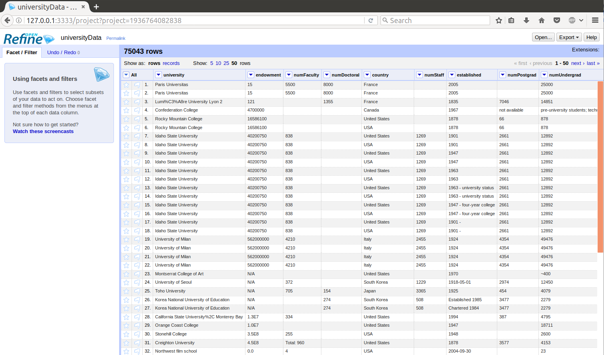
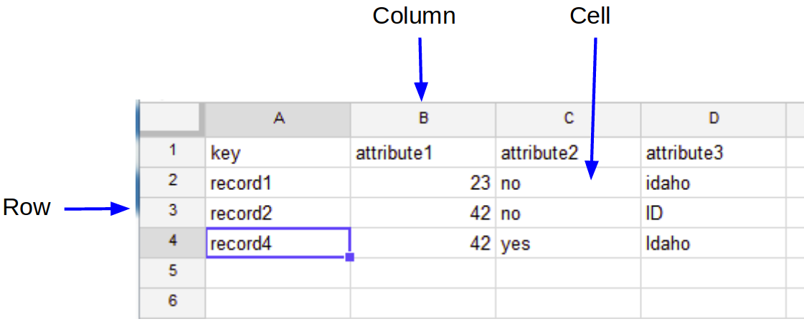

# What is OpenRefine?

OpenRefine is a [free](https://www.gnu.org/philosophy/free-sw.en.html), [open source](https://github.com/OpenRefine/OpenRefine), Java application, that runs offline in a web browser. 

> **“A power tool for working with messy data”**
>
> - more powerful than a spreadsheet
> - more interactive and visual than scripting
> - more provisional / exploratory / experimental / playful than a database
>
> [David Huynh](http://web.archive.org/web/20141021040915/http://davidhuynh.net/spaces/nicar2011/tutorial.pdf)

## Exciting Trailers from Google!

If you want a visual introduction, check out these trailers from Google created for an early version:

- [Introduction](https://youtu.be/B70J_H_zAWM)
- [Data Transformation](https://youtu.be/cO8NVCs_Ba0)
- [Data Augmentation](https://youtu.be/5tsyz3ibYzk)

## Tabular Data 

Refine can handle all sorts of data!

- Import formats: TSV, CSV, custom separator txt, Excel, XML, JSON, Google Spreadsheets, RDF
- Sources: local file, archive (zip), URL, clipboard, or Google

Comfortable performance up to 100,000's of rows.

## Use Cases

**Clean** - discover and fix inconsistency with faceting, clustering, cell transforms, GREL expressions...

**Transform** - change formats or reshape with split/join multi valued cells, split columns, transpose columns/rows...

**Extend** - enrich data by combining files, merging projects, fetching URLs, reconciliation with online databases...

**Automate** - reuse your processing routine by exporting operation history in JSON!
