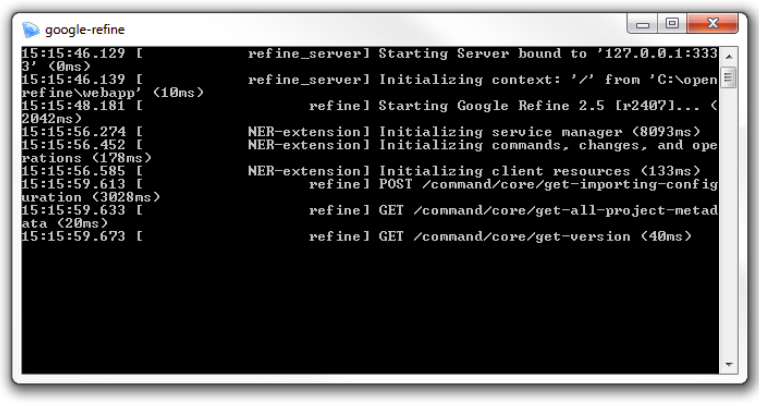

# Setup Refine
    
- Install Java if you do not have it, http://java.com/en/ (be sure to uncheck the "recommended" option to add Yahoo to your browsers!)
- Download the OpenRefine package for your OS, http://openrefine.org/download.html (version 2.6-rc2 is known to work well, although a new version 2.7-rc1 was recently released)
- Extract the package to a permanent location, for example in your User directory or Documents. On Windows, unzip by right clicking and selecting Extract All. On Mac, drag `dmg` to the application folder (Mac has known [issues](https://github.com/OpenRefine/OpenRefine/wiki/Installation-Instructions#mac-osx), try these [solutions](https://gist.github.com/evanwill/138ff4a31a4bfd61c5626e43bee22772)). On Linux, unpack to desired location with `tar xzf google-refine.tar.gz`. 

(get the latest advice from the [official wiki](https://github.com/OpenRefine/OpenRefine/wiki/Installation-Instructions))

# Start Refine

1. Windows: double click `openrefine.exe`. Mac: click Refine icon. Linux: in the Refine directory open terminal and `./refine`.
2. The application should start running in a terminal window. 
3. Your default web browser should automatically open the GUI at http://127.0.0.1:3333

**To shut down:** close browser window then close the host window with `Ctrl+C`.