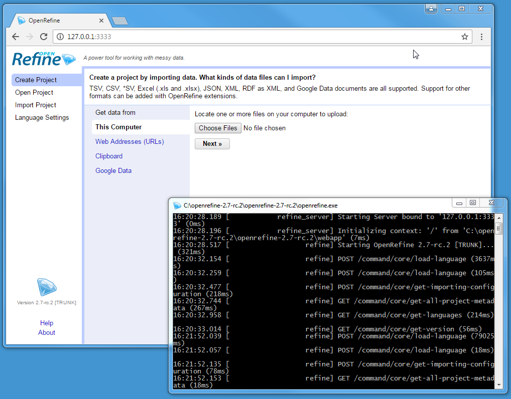

# Setup Refine
    
1. Install [Java](http://java.com/en/) if you do not have it (be sure to uncheck the "recommended" option to add Yahoo to your browsers!)
2. Download the most recent [OpenRefine package](http://openrefine.org/download.html) for your OS.
3. Extract the package to a permanent location, for example in your User directory or Documents. 
    - Windows: unzip by right clicking and selecting Extract All. 
    - Mac: drag `dmg` to the application folder (Mac has known [issues](https://github.com/OpenRefine/OpenRefine/wiki/Installation-Instructions#mac-osx), try these [solutions](https://gist.github.com/evanwill/138ff4a31a4bfd61c5626e43bee22772)). 
    - Linux: unpack to desired location with with `tar`, for example `tar xzf openrefine-linux-2.7-rc.2.tar.gz`. 

Full documentation is available on the [official wiki](https://github.com/OpenRefine/OpenRefine/wiki/).

# Start Refine

1. Start the Java app. It will start running in a terminal window which you can ignore and minimize (but do not close!).
    - Windows: double click `openrefine.exe` (You may get a warning that the publisher could not be verified, ignore it, and click *Run*. Once open, pin the Refine icon to your taskbar for easy access in the future). 
    - Mac: click Refine icon. 
    - Linux: in the Refine directory open terminal and `./refine`.
2. Use the GUI. Your default web browser should automatically open with the interface. If it does not open automatically or you close the browser tab, find the GUI by typing [http://127.0.0.1:3333](http://127.0.0.1:3333) in your address bar. 
3. **To shut down:** close any browser tabs with the GUI, then stop the host terminal window with `Ctrl+C`. This will ensure open projects are saved.

> *Note:* The user interface is rendered by your web browser, but Refine is not a web application. No information is sent online and no internet connection is necessary.
